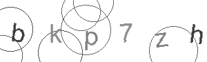

# CAPTCHA Generator

## 🎯 Motivation

This project was born out of a practical need during a freelance project. I encountered a CAPTCHA challenge that I needed to solve programmatically using a neural network. However, training a neural network requires a large dataset of images to achieve high accuracy.

When I searched for similar CAPTCHAs online, I couldn't find any datasets that matched the specific style I needed. Rather than giving up, I decided to take a different approach: **learn how to create CAPTCHAs myself**.

I dove into research, watched educational videos about CAPTCHA generation, studied reference repositories, and experimented with different techniques. Through this process, I successfully built a CAPTCHA generator that closely resembles the one I needed to bypass.

This experience was incredibly rewarding and quite different from conventional programming tasks. I decided to share this repository because it represents not just a tool, but a learning journey that others might find useful or inspiring.

---

## 🖼️ Example Output

Here's an example of a generated CAPTCHA:

<p align="center">
  
</p>

The generator creates images with:
- 6-character alphanumeric text (customizable)
- Rotated and randomly positioned characters
- Circular noise patterns for obfuscation
- Variable grayscale colors for characters and circles
- 300x90 pixel dimensions (customizable)

---

## 🚀 Getting Started

### Prerequisites

- Python 3.7 or higher
- pip (Python package manager)

### Installation

1. **Clone the repository**
```bash
git clone https://github.com/JoaoVieiraSCM/CaptchaGenerator.git
cd CaptchaGenerator
```

2. **Install dependencies**

**Option A: Using pip directly**
```bash
pip install Pillow
```

**Option B: Using virtual environment (recommended)**
```bash
# Create virtual environment
python -m venv venv

# Activate virtual environment
# On Windows (PowerShell):
.\venv\Scripts\Activate.ps1
# On Windows (CMD):
.\venv\Scripts\activate.bat
# On Linux/Mac:
source venv/bin/activate

# Install dependencies
pip install -r requirements.txt
```

---

## 📖 Usage

### Basic Usage

Generate 10,000 CAPTCHAs (default):
```bash
python captcha_generator.py
```

Generate a specific number of CAPTCHAs:
```bash
python captcha_generator.py 100
```

Generated images will be saved in `captcha_data/images/` with filenames matching their text content (e.g., `abc123.png`).

### Configuration

For ease of use and accessibility, I've separated all the main configuration parameters into a dedicated `config.py` file. This design choice makes it simple for anyone to customize the CAPTCHA generator without diving into the main code logic. You can easily adjust the generator's behavior by editing `config.py`:

```python
# Directory where images are saved
OUTPUT_DIR = 'captcha_data/images'

# Default number of CAPTCHAs to generate
DEFAULT_NUM_CAPTCHAS = 10000

# Length of CAPTCHA text
CAPTCHA_LENGTH = 6

# Characters used in CAPTCHA generation
CHARACTERS = 'abcdefghijklmnopqrstuvwxyz0123456789'

# Image dimensions
CAPTCHA_WIDTH = 300
CAPTCHA_HEIGHT = 90

# Font settings
FONT_PATH = "C:\\Windows\\Fonts\\arial.ttf"
FONT_SIZE = 38
```

---

## 🔧 How It Works

The generator creates CAPTCHAs through the following process:

1. **Text Generation**: Randomly selects characters from the defined character set to create CAPTCHA text

2. **Image Creation**: Creates a blank white canvas with configurable dimensions

3. **Background Noise**: Draws 6-8 random circles with varying sizes and positions to add complexity

4. **Character Rendering**: 
   - Each character is rendered individually with a random rotation (-8° to 8°)
   - Characters are positioned with slight random offsets for a natural look
   - Each character uses a randomly selected grayscale color

5. **Image Export**: Saves the final image as a PNG file named after its text content

### Key Features

- **Randomization**: Every CAPTCHA is unique due to random positioning, rotation, colors, and noise patterns
- **Configurable**: Easy to adjust difficulty by modifying parameters in `config.py`
- **Fast Generation**: Can generate thousands of CAPTCHAs quickly for dataset creation
- **Simple API**: Clean code structure for easy understanding and modification

---

## 📁 Project Structure

```
CaptchaGenerator/
├── captcha_generator.py   # Main generator script
├── config.py              # Configuration file
├── requirements.txt       # Python dependencies
├── .gitignore            # Git ignore rules
├── README.md             # This file
└── captcha_data/
    └── images/           # Generated CAPTCHA images
```

---

## 🤝 Contributing

Contributions are welcome! Feel free to:
- Report bugs
- Suggest new features
- Submit pull requests
- Share your use cases

---

## 📝 License

This project is open source and available under the MIT License.

---

## 🎓 Learning Resources

If you're interested in learning more about CAPTCHA generation and computer vision:
- Study image manipulation with PIL/Pillow
- Explore neural network approaches for CAPTCHA solving
- Research adversarial examples and security implications
- Look into modern CAPTCHA alternatives (reCAPTCHA, hCaptcha)

---

## ⚠️ Disclaimer

This project is intended for educational purposes, security research, and legitimate use cases such as testing your own systems. Please use responsibly and respect website terms of service.

---

**Made with curiosity and determination** 🚀